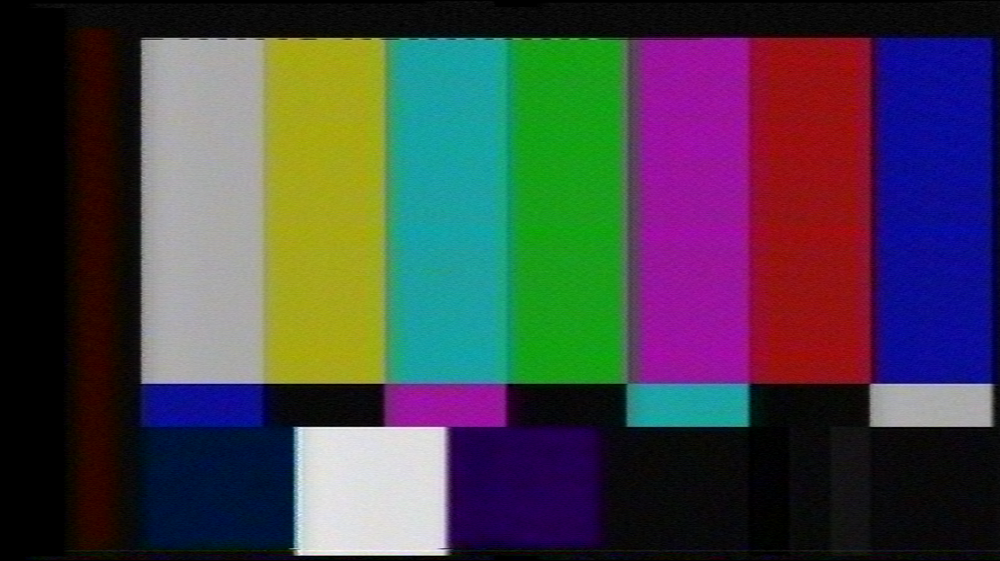

# VHS-Decode (It does more than VHS now!)

A fork of [LD-Decode](https://github.com/happycube/ld-decode), the decoding software powering the [Domesday86 Project](https://www.domesday86.com/).  
This version has been modified to work with the differences found in the tracked RF drum head signals taken directly from colour-under & FM modualted composite format video tape.

(Not to be confused with the TV Modulator/Demodulator pack or the **"antenna connectors"** on the back of the VCR!).

SMPTE ColourBars (16:9) Test Tape With [WSS](https://github.com/oyvindln/vhs-decode/wiki/Wide-Screen-Signalling) (PAL) exported full-frame (1112 x 624)

# [Supported Tape Formats](https://github.com/oyvindln/vhs-decode/wiki/Tape-Support-List)

**VHS** 625-line and 525-line - NTSC, NTSC-J, PAL and PAL-M. **Generally well supported**

**SVHS** 625-line and 525-line - NTSC, NTSC-J, PAL and PAL-M. **Basic support**

**U-Matic Low Band** 625-line and 525-line - PAL and NTSC. **Supported**

**U-Matic High Band** 625-line - PAL. **Basic support**

**Betamax** 625-line and 525-line - PAL & NTSC. **Suppported**

**Video8 & Hi8** 625-line and 525-line - PAL & NTSC. **Basic support**

**1" Type C (SMPTE Type C)** 625-line and 525-line - PAL & NTSC. **Basic support** (More Samples Required!) 

**EIAJ** 625-line - PAL. **Supported** (NTSC Samples Required!) 

**Philips VCR** 625-line - PAL. **Supported**

# [FAQ - Frequently Asked Questions](https://github.com/oyvindln/vhs-decode/wiki/FAQ)

Example Videos: [VHS-Decode](https://odysee.com/@vhs-decode:7) / [The Rewinding](https://odysee.com/@therewinding:4?view=content) - Odysee

Example Workflow [Flowcharts and Overview Graphics](https://github.com/oyvindln/vhs-decode/wiki/Diagram-Visuals)

The frequently asked questions page and the [Wiki](https://github.com/oyvindln/vhs-decode/wiki), will help break things down and explain the real world benefits of direct RF capture preservation and software decoding compared to conventional high-cost hardware based workflows, so if you have just found this project welcome to the affordable future of tape media preservation.

# [CVBS-Decode - Composite Video Decoder](https://github.com/oyvindln/vhs-decode/wiki/CVBS-Composite-Decode)

This repository also contains an **experimental** CVBS decoder, `cvbs-decode`, which shares code with ld-decode and vhs-decode. Capable of decoding basic raw digitized NTSC and PAL composite video, including colour if the source is somewhat stable. 

RAW CVBS has been captured using CX Cards & CXADC, however, only at lowest gain states, CVBS capture is not possible with the DomesDayDuplicator Rev3 due to input filtering on the hardware.

Test samples & signals can be generated using [HackTV](https://github.com/fsphil/hacktv)

Note for test media generation AJA/Magewell/Blackmagic and even some consumer digital to analogue converters have test generators built-in some prosumer/broadcast decks also have generators built in same for HDV camcorders.

# [HiFi-Decode](https://github.com/oyvindln/vhs-decode/wiki/003-Audio#hifi-decode-hifi-rf-into-audio-installation-and-usage) & [RTL-SDR Decode](https://github.com/oyvindln/vhs-decode/wiki/RTLSDR)

Thanks to VideoMem's work on [Superheterodyne Decoding Tools](https://github.com/VideoMem/Superheterodyne-decoding-tools) we now have a working [HiFi Audio Decoder](https://github.com/oyvindln/vhs-decode/wiki/003-Audio) which provides decoding for VHS & Video8/Hi8 HiFi FM tracks which takes uncompressed or FLAC compressed RF captures of HiFi FM signals and outputs standard 24-bit 192khz FLAC or PCM (.wav) stereo files. RTLSDR decode can run in realtime (1~3 sec delay) and provide live playback 8msps RF files and a 48khz 24-bit FLAC file of the decoded audio.

# Dependencies - Hardware

## A Working Tape Player (VCR/VTR etc)

Preferably adjusted per tape and in excellent mechanical and head condition, prosumer metal track decks are preferable as they were built generally better in terms of mechnical stability than cheaper later consumer decks that use more plastics, the only **crtical requirement** is avalible test points or a head amplifyer that is easy to tap into, this goes for any and all tape formats.

**Note** SVHS tapes can be RF captured on standard VHS HiFi decks.

**Note** SVHS NTSC Decks - Currently inflated, but you can import PAL decks with NTSC support for 1/3rd the price though this only applys if conventional refrance SVHS captures are required.

**Always clean your tape track/drum/heads** before and afterwards with 99.9% isopropanol and lint free cloths/pads/paper. This ensures less dropouts from dirty heads or tracks including the track of the head drum.

Its good practice to avoid cross contamination of tapes, especially if dealing with mouldy or contaminated tapes.  

It also helps to make sure to re-lubricate metal and plastic moving joints cogs and bearings with appropriate greases and oils to avoid mechanical failures. Please read the [Cleaning & Servicing Guide](https://github.com/oyvindln/vhs-decode/wiki/Cleaning-&-Servicing-Guide)

## An RF Capture Device

Currently standardised is 2 hardware methods but RF capture is not limited to these methods.

## [Domesday Duplicator (DdD)](https://github.com/happycube/ld-decode/wiki/Domesday-Duplicator) (Method 01 - 300-350USD*)

Capture is done using an simple GUI application.

[Linux Application](https://github.com/harrypm/DomesdayDuplicator#readme) / [Windows Application](https://github.com/vrunk11/DomesdayDuplicator/releases/tag/fix_1.1) / [MacOS Application](https://github.com/harrypm/DomesdayDuplicator#macos-software-installation)

Originally geared towards capturing RF from Laserdisc players, it does however also work perfectly well for digitizing tape RF data. It consists of a custom analogue to digital board with an amplifier, an off-the-shelf DE0-NANO FPGA development board, and a Cypress FX3 SuperSpeed Explorer USB 3.0 board.

**Note** Dont use USB storage or video devices on the same USB bus as the DdD, it will crash the capture!

**Note** Several users have reported issues with dropped samples when using the ddd do capture on Windows, so as of now using it on Windows is not recommended.

[Ware to Buy? & More Info](https://github.com/happycube/ld-decode/wiki/Domesday-Duplicator)

## [CX Card & CXADC](https://github.com/oyvindln/vhs-decode/wiki/CX-Cards) (Method 02 - 20-35USD)

Capture & Config uses simple command-line arguments and parameters [CXADC](https://github.com/happycube/cxadc-linux3)

The budget approach is using a video capture card based on a Conexant CX23880/1/2/3 PCI chipset. With a modified Linux driver, these cards can be forced to output RAW data that can be captured to file, instead of decoding video normally as they otherwise would.

While you can use any generic card with the correct chips, today we recommend the ‘‘New’’ Chinese variants that can be found on AliExpress that have integrated Asmedia or ITE 1x PCIE bridge chips allowing modern systems to use them, and consistent performance.

[Ware to Buy? & More Info](https://github.com/oyvindln/vhs-decode/wiki/CX-Cards)

Sadly however at stock without any modifications CX Cards proform slightly worse then a DomesdayDuplicator with about a 3db signal to noise difference, and its internal digital gain can affect captures drastically.

Currently the CX23883-39 based white variant cards have been consistently lower noise, these have also been easily upgraded to 40msps 8-bit with a drop-in crystal upgrade for use with formats like LaserDisc, but at stock with external amplification they are quite optimal for VHS & HiFi, but higher bandwidth formats like SVHS & ED Beta can benifit from crystal upgrades and can also be used with external timing for syncronised capture of Video+HiFi+Linear signals.

# Deployment of Capture Hardware

Please read [VCR Reports](https://github.com/oyvindln/vhs-decode/wiki/VCR-reports) / [The Tap List](https://github.com/oyvindln/vhs-decode/wiki/004-The-Tap-List) / [Hardware Installation Guide](https://github.com/oyvindln/vhs-decode/wiki/Hardware-Installation-Guide)

Information on various VCRs that have been documented alongside high resolution pictures of VCR's that have had RF taps installed, guidance on recommended cables/connectors & tools to use are also included.

The setup process for RF capture involves running a short cable internally from points that provide the unprocessed video and or audio signal to a BNC jack at back of a metal/plastic VCR chassis or threaded out a vent, this allows direct access to the FM RF signals conveniently & reliably, we call this a Tap Point or RF Tap, for some decks and camcorders however Dupont conectors and ribbon jigs can be used.

VCR ==> Head Drum ==> Amplification & Tracking ==> FM RF Test/Signal Points ==> FM RF Capture ==> Software Decoding ==> Lossless TBC Files ==> Audio/Video File Creation.

### Finding Test Points - There Names

Decks follow this naming or close to it not every possible name is covered.

**Video FM RF Signal:**

`RF C`, `RF Y`, `RF Y+C`, `V RF`, `PB`, `PB.FM`, `V ENV`, `ENV`, `ENVE`, `ENVELOPE`, `VIDEO ENVE`, `VIDEO ENVELOPE`

**HiFi Audio FM Signal:**

`HiFi`, `A.PB`, `A FM`, `A.PB.FM`, `Audio FM`, `A-Out`, `A ENV`, `HIFI Envelope`, `FM Mix Out`

That a test points has this name doesn't automatically mean it will have the signal we want, especially when it comes to hi-fi audio, be sure to check with the service manual if possible.

## Parts for RF Tap

[What tools do I need?](https://github.com/oyvindln/vhs-decode/wiki/Hardware-Installation-Guide)

* 50ohm BNC connectors, normally a [premade bulkhead](https://www.aliexpress.com/item/4000981154513.html), or [solderable thread mounted](https://www.aliexpress.com/item/4000639816847.html).
* 50-100cm of [RG316](https://www.aliexpress.com/item/32726071013.html) or [RG178](https://www.aliexpress.com/item/32879341402.html) 50 ohm coaxial cable.
* 10uf Capacitors [standard assorment](https://www.aliexpress.com/item/1005003276169319.html?) or audio grade like Nichicon if you like.

Connection Cables

* [Direct BNC to BNC](https://www.aliexpress.com/item/32530974771.html?) 
* [50Ohm BNC to BNC Cable](https://www.aliexpress.com/item/1005004558208116.html?)
* [S-Video to BNC](https://www.aliexpress.com/item/1005003333398231.html)

On CX White Cards you use the S-Video Luma pin for the RF input, but a BNC can be easily added.

## Install A RF Tap

[Hardware Installation Guide]() Goes over the install steps for VHS Decks to Sony 8mm camcorders.

If you want to still use live playback or are using lower signal decks adding an 10uf (3.3uf to 100uf range) capacitor to the test point or amplifier can stop dropouts and improve signal level, avoiding dropouts.

Center is Signal, Outer is Ground, this goes for jacks and for coaxial cable in genaral.

The Negative leg (shorter) goes on test/signal point, Positive leg (longer) on cable to connector/probe

While type and voltage does not matter much its best to use new/tested capacitors.

## Notes:

**Note** We use Aliexpress links for wide availability globally, but local venders are a thing.

**Note** With some Sony decks you can use Dupont connectors on the test point pins making an easy RF tap.

**Note**  Do not make sharp bends in any RF cabling, keep total cable runs as short as possible Ideally 30-60cm, more cable = more signal loss.

**Note** Some UMATIC decks have an RF output on the back, however this only provides Luma RF for dropout detection and not the full signal required for RF capture.

# Windows Builds & WSL2

[Windows Binarys Download](https://github.com/oyvindln/vhs-decode/wiki/Windows-Build)

The ld-tools suit alongside a combined exe version of `ld-decode` / `vhs-decode` / `cvbs-decode` has been ported to windows. This allows the use of ld-analyse to view TBC files and ld-lds-converter to convert and compress DdD captures inside Windows with drag and drop bat scripts, hifi-decode has yet to be ported, but [RTLSDR-Decode](RTLSDR) is cross plafrom as its GNURadio based.

[Windows Sub-System For Linux - WSL2 Setup](https://github.com/oyvindln/vhs-decode/wiki/WSL2-Setup)

The decode suit can also run navtively inside WLS2 for Windows 10/11.

# MacOS Builds

See building on MacOS page on [MacOS Build](https://github.com/oyvindln/vhs-decode/wiki/MacOS-Build) install docs are only currently for ARM based apple products such as the M1/M2 lines.

# Dependencies & Installation - Software

VHS-Decode, as with LD-Decode, has been developed and tested on machines running the latest versions of Ubuntu, Debian and Linux Mint.
The tools should however be able to be built on other distrubutions too provided they have access somewhat recent versions to the needed dependencies, including at least python 3.8.

There is a [Linux compatability doc](https://docs.google.com/document/d/132ycIMMNvdKvrNZSzbckXVEPQVLTnH_YX0Oh3lqtkkQ/edit) for various tested distributions of Linux.

Its fully working on WSL2 22.04.1 LTS (Windows Subsystem for Linux) however issues with larger captures i.g 180gb+ may require expanding the default [virtual disk size](https://docs.microsoft.com/en-us/windows/wsl/vhd-size).

Other dependencies include Python 3.8+, numpy, scipy, cython, numba, pandas, Qt5, qwt, Cmake, and FFmpeg.

Some useful free tools to note for post processing are
[StaxRip](https://github.com/staxrip/staxrip) & [Lossless Cut](https://github.com/mifi/lossless-cut) & of course [DaVinci Resolve](https://www.blackmagicdesign.com/uk/products/davinciresolve) - these give you basic editing to quickly handle uncompressed files across operating systems, and for Windows users an easy FFmpeg/AviSynth/Vapoursynth encoding and QTGMC de-interlacing experience, and full colour grading and post production ability.

# Installation on Linux (Ubuntu/Debian-based)

Install all dependencies required by LD-Decode and VHS-Decode:

    sudo apt install clang python3-setuptools python3-numpy python3-scipy python3-matplotlib git qt5-default libqwt-qt5-dev libfftw3-dev python3-tk python3-numba libavformat-dev libavcodec-dev libavutil-dev ffmpeg openssl pv python3-distutils make cython3 cmake pipx

For Ubuntu 22.04 that is:

    sudo apt install clang python3-setuptools python3-numpy python3-scipy python3-matplotlib git qt5-qmake qtbase5-dev libqwt-qt5-dev libfftw3-dev python3-tk python3-numba libavformat-dev libavcodec-dev libavutil-dev ffmpeg openssl pv python3-distutils pkg-config make cython3 cmake pipx

Set up pipx

    pipx ensurepath

(Alternatively, a [python virtual environment](https://docs.python.org/3/library/venv.html) can be used instead of using pipx)

Optional dependencies for GPU (Nvidia Cards) FLAC compression support:

    sudo apt install make ocl-icd-opencl-dev mono-runtime

## Build VHS-Decode & LD-Tools Suite

The vhs-decode respository also has hifi-decode, cvbs-decode, ld-decode included.

Download VHS-Decode:

    git clone https://github.com/oyvindln/vhs-decode.git vhs-decode

Install VHS-Decode:

    cd vhs-decode

Build and install vhs-decode via pipx

    pipx install .

Compile and Install ld-tools suite: (Required)

    mkdir build2
    cd build2
    cmake .. -DCMAKE_BUILD_TYPE=Release -DUSE_QT_VERSION=5
    make -j4
    sudo make install
   

Go back to the main directory with 

    cd .. 

To update do `git pull` while inside of the vhs-decode directory.
To update to the latest git version of vhs-decode/ld-decode/hi-fi decode, run `pipx install .` inside the vhs-decode directory after running `git pull`
To update the tools to the latest version, the steps under "Compile and Install ld-tools suite: (Required)" has to be re-ran after a `git pull`. The tools are not updated very often.

**Note:** debian/ubuntu does not have a qt6 version of qwt in repositories as of yet so you have to inform the build script to use Qt5 if both qt5 and qt6 are installed with -DUSE_QT_VERSION=5 as it might otherwise try to compile with qt6 instead and failing to locate qwt. The option is otherwise not needed.

# Usage

Note with WSL2 & Ubuntu, `./` in front of applications and scripts may be needed to run them or to run scripts within the folder.

Use `cd vhs-decode` to enter into the directory to run commands, `cd..` to go back a directory.

Use <kbd>Ctrl</kbd>+<kbd>C</kbd> to stop the current process.

You dont actaully type `<` and `>` on your input & output files.

## Basic CX Card Setup & RF Capture

* Ensure system is powered off
* Physically Install CX Card
* Install CXADC driver

------------

Connect Card to RF Tap

* Find Vmux Input (Via Live Preview)
* Configure Capture
* Capture RF Data
* FLAC Compress RF Data (Archive)

[CXADC Readme](https://github.com/happycube/cxadc-linux3#readme) for information on how to install & configure the driver, this also goes into depth on modes.

[Commands for real-time FLAC capture on CX Cards](https://github.com/happycube/cxadc-linux3/wiki/FLAC-Compression-Guide)

[Naming Guide For RF Captures!](https://github.com/oyvindln/vhs-decode/wiki/Capture-Naming-Guide)

To see if you have a connection, use the live preview mode and then hook up your RF cable, normally you will see a white flash as a signal, if not change your vmux or input within a 0-2 range with the below command.

    sudo echo 0 >/sys/class/cxadc/cxadc0/device/parameters/vmux

To see a live preview of tape signal being received by a CXADC card, note that the video head tracked signal will be unstable or wobbly if settings are not the same; you may only see "signal flash" if in 16-bit mode for example.

This is quite useful if you don't own a CRT with Horizontal/Vertical shifting, as it will allow you to inspect the full area for alignment and/or tracking issues.

PAL framing for the default 28.64 MHz/8-bit mode:

    ffplay -hide_banner -async 1 -f rawvideo -pix_fmt gray8 -video_size 1832x625 -i /dev/cxadc0 -vf scale=1135x625,eq=gamma=0.5:contrast=1.5

NTSC framing for 28.64 MHz/8-bit mode:

    ffplay -hide_banner -async 1 -f rawvideo -pix_fmt gray8 -video_size 1820x525 -i /dev/cxadc0 -vf scale=910x525,eq=gamma=0.5:contrast=1.5

Capture 30 seconds of tape signal using CXADC driver 8-bit samples

    timeout 30s cat /dev/cxadc0 > <capture>_CXADC.u8

For 16-bit, simply change the output filename extension to `.u16`

For FLAC captures, set the output filename extension to your desired tape format, for example `.VHS`

It is recommended to use a fast storage device with 40-100 MB/s or faster write capacity, in order to avoid dropped samples, ideally an dedicated SSD (via M.2 or SATA connector, not USB) formatted with the exFAT filesystem.

## What should a FM video signal look like on the preview?

## Compress your FM RF Captures

For DomesDayDuplicator captures on Linux simply run:

`ld-compress <capture>`

For DomesDayDuplicator captures on Windows simply drag and drop on: 

`ld-compress.bat` or `ld-compress-nvidia-gpu.bat`

Your `.lds` file will be compressed to an FLAC OGG `.ldf` file.

For CXADC and other standard 8-bit or 16-bit RF captures use the following:

[Copy Paste FLAC Compression Commands for CXADC](https://github.com/happycube/cxadc-linux3/wiki/FLAC-Compression-Guide#post-capture-flac-compression)

Editable flags are:

The `--bps` flag can be changed to `--bps=8` or `--bps=16` for 8 & 16 bit captures and `--ogg` is optional.

Change `<capture>` & `<output-name>` to your input & output file name.

Reduce size of captured CXADC data (by 40-60%):

    flac --best --sample-rate=28636 --sign=unsigned --channels=1 --endian=little --bps=8 --ogg -f <capture>.u8 <output-name>

Output will be `filename.ogg` so rename the end extension to `.vhs` / `.hifi` etc.

Decompress FLAC compressed captures:

    flac -d --force-raw-format --sign=unsigned --endian=little <capture>.vhs <capture>.u16

# Decoding FM RF Captures

Decode your captured tape to `.tbc` by using:

    vhs-decode [arguments] <capture file> <output name>

Basic Usage Example:

    ./vhs-decode --debug --pal --threads 8 --tape_format VHS --cxadc CX-White-2022.10.25.u8 my-first-decode-2022.10.25

After decoding process your tapes VBI data with:

    ld-process-vbi <decoded tape name>.tbc

Use analyse tool to inspect decoded tape data:

    ld-analyse <decoded tape name>.tbc

(`.tbc` files are headerless you can open them at any time during decoding, preview is limited to what frame info has been fully written to the JSON file updated every 100 frames or so)

## Exporting to Video Files

VHS-Decode produces two timebase corrected files an S-Video signal in the file domain for VHS/Beta/Video8/Hi8 etc, It can also produce a single CVBS file for formats like SMPTE-C/B. 

These are stored in 16-bit `GREY16` headerless files separated into chroma/luma composite video signals in the `.tbc` format `filename.tbc` & `filename_chroma.tbc` respectively alongside `.json` and `.log` files with frame and decode information, usable with the LD-Decode family of tools ld-analyse, ld-process-vbi, ld-process-vits, ld-dropout-correct & ld-chroma-decoder etc 

The export scrips will by default render a lossless, interlaced top field first and high-bitrate (roughly 70-100 Mb/s) FFV1 codec video which, which although ideal for archival and further processing has only recently started to gain support in modern [NLEs](https://en.wikipedia.org/wiki/Non-linear_editing).

To generate .mkv files viewable in most media players, simply use the `tbc-video-export.py` script below.

Read the `README_gen_chroma_vid_scripts` readme for the legacy script options.

### Export your TBC files to a video file with the following basic command

Linux & MacOS

    python3 tbc-video-export.py Input-Media.tbc

Windows

    tbc-video-export.exe Input-Media.tbc

### [Read the full export guide here!](https://github.com/oyvindln/vhs-decode/wiki/TBC-to-Video-Export-Guide)

## Profile Options 

For archival to web use we have a wide range of pre-made FFmpeg profiles defined inside the `tbc-video-export.json` file.

Note for Odysee uploads the provided web files are ideal, for Vimeo de-interlace the FFV1 export, but for YouTube de-interlace and upscale to 5760x4320p to have base possible re-encoding from there side as SD/HD media is overcompressed on YouTube.

The stock profiles for web use the BDWIF deinterlacer, but QTGMC is always recommended, [de-interlacing guide](https://github.com/oyvindln/vhs-decode/wiki/Deinterlacing).

ProRes 4444XQ & FFV1 with PCM audio have been added for editing support.

Define your profile with for example: `--ffmpeg-profile ffv1_8bit_pcm`

| Profile Name  | Codec         | Compression Type     | Bit-Depth | Chroma Sub-Sampling | Audio Format | Container | File Extension | Bitrate    |
|---------------|---------------|----------------------|-----------|---------------------|--------------|-----------|----------------|------------|
| ffv1          | FFV1          | Lossless Compressed  | 10-bit    | 4:2:2               | FLAC Audio   | Matroska  | .mkv           | 70-100mbps |
| ffv1_8bit     | FFV1          | Lossless Compressed  | 8-bit     | 4:2:2               | FLAC Audio   | Matroska  | .mkv           | 40-60mbps  |
| ffv1_pcm      | FFV1          | Lossless Compressed  | 10-bit    | 4:2:2               | PCM Audio    | Matroska  | .mkv           | 70-100mbps |
| ffv1_8bit_pcm | FFV1          | Lossless Compressed  | 8-bit     | 4:2:2               | PCM Audio    | Matroska  | .mkv           | 40-60mbps  |
| prores_hq_422 | ProRes HQ     | Compressed           | 10-bit    | 4:2:2               | PCM Audio    | QuickTime | .mov           | 55-70mbps  |
| prores_4444xq | ProRes 4444XQ | Compressed           | 10-bit    | 4:4:4               | PCM Audio    | QuickTime | .mov           | 80-110mbps |
| v210          | V210          | Uncompressed         | 10-bit    | 4:2:2               | PCM Audio    | QuickTime | .mov           | 200mbps    |
| v410          | V410          | Uncompressed         | 10-bit    | 4:4:4               | PCM Audio    | QuickTime | .mov           | 400mbps    |
| x264_web      | AVC/H.264     | Lossy                | 8-bit     | 4:2:0               | AAC Audio    | QuickTime | .mov           | 8mbps      |
| x265_web      | HEVC/H.265    | Lossy                | 8-bit     | 4:2:0               | AAC Audio    | QuickTime | .mov           | 8mbps      |

## Time Control & Audio Muxing

Command Examples:

     python3 tbc-video-export.py -v -s <skip number of frames> -l <number of frames long> -i <.tbc filename without .tbc extension>

The `-a` option can embed an audio file, such as audio decoded via [HiFi Decode](https://github.com/VideoMem/ld-decode/tree/hifi-decode)

     python3 tbc-video-export.py -v -s <skip n frames> -l <n frames long> -a <capture>.flac -i <.tbc filename without .tbc extension>

So for example open terminal in the directory of target TBC/Metadata files and run

     python3 tbc-video-export.py -v -s <skip n frames> -l <number of frames long> -a <capture>.flac -i <.tbc filename without .tbc extension>

## VBI (Vertical Blanking Interval) Data Recovery

Software decoding provides the full signal frame, recovery software can be used to read and extract this information, however some information can be automatically extracted in the TBC file stage with `ld-processs-vbi` like VITC & Closed Captions. 

[VITC Timecode](https://github.com/oyvindln/vhs-decode/wiki/VITC-SMPTE-Timecode) (Standard SMPTE Timecode)

[CC EIA-608](https://github.com/oyvindln/vhs-decode/wiki/Closed-Captioning) (Closed Captioning)

[Teletext](https://github.com/oyvindln/vhs-decode/wiki/Teletext) (European Subtitles & Information Graphics)

[Tape-based Arcade Games!](https://vhs.thenvm.org/resources/)

[Ruxpin TV Teddy](https://github.com/oyvindln/vhs-decode/blob/vhs_decode/tools/ruxpin-decode/readme.pdf) (Extra audio in visable frame)

### Generate an video output with the top VBI area:

    python3 tbc-video-export.py --vbi 

## Terminal Arguments

VHS-Decode supports various arguments to change how captured tape recordings are processed. These vary slightly between formats like VHS & Umatic but the basic oprations remain the same.

The list below is a short list for common/daily usage but does not cover all the abilities and new or advanced command arguments possible so please read the [complete and upto-date command list](https://github.com/oyvindln/vhs-decode/wiki/Command-List) on the wiki as commands may change or be deprecated, so its always good to check this list for any updates.

## Sample Rate Comamnds

By default, this is set to 40 MHz (the sample rate used internally and by the Domesday Duplicator) at 16 bits.

The decoder is 8/16 bit agnostic so as long as sample rate is defined, it will decode it.

`-f`  Adjusts sampling frequency in integer units.

Example's `-f 280000hz` or `-f 28mhz` or `-f 8fsc`

`-tf` Sets Tape Format enter `VHS`, `SVHS`, `UMATIC`, `UMATIC_HI`, `BETAMAX`, `VIDEO8`, `HI8`, `TYPEC`, `EIAJ`, `VCR` (Default is VHS)

##  CXADC Specific Sample Rate Commands

`--cxadc`    28.6 MHz/8-bit  (8fsc)

`--cxadc3`   35.8 MHz/8-bit  (10fsc) (Not recommended for capture due to up-sampling)

`--10cxadc`  14.3 MHz/16-bit (4fsc)

`--10cxadc3` 17.9 MHz/16-bit (5fsc)

## Colour System Commands

Changes the colour or TV system to NTSC, PAL, PAL-M, NTSC-J, or [MESECAM](https://en.wikipedia.org/wiki/SECAM#MESECAM_(home_recording)) respectively.
Please note that, as of this writing, support for PAL-M is **experimental**.

`-n` = NTSC

`-p` = PAL

`--pm` = PAL-M

`--NTSCJ` = NTSC-J

`--MESECAM` = MESECAM

# [Time & Location Control](https://github.com/oyvindln/vhs-decode/wiki/Command-List#time--location-control)

These commands are used for jumping ahead in a file or for defining limits.
Useful to recover decoding after a crash, or for limiting process time by producing shorter samples.

`-s`  Jumps ahead to any given frame in the capture.

`--start_fileloc` Jumps ahead to any given *sample* in the capture.

`-l` Limits decode length to *n* frames.

`-t` Defines the number of processing threads to use during demodulation, decode cant use more then 6-8 threads per decode currently so using 8 threads is the practical limit as its mostly a single core task.

(note: upon crashing, vhs-decode automatically dumps the last known sample location in the terminal output)

## [Time Base Correction & Visuals Control](https://github.com/oyvindln/vhs-decode/wiki/Command-List#decode-tbc---time-base-correction-control)

`--debug` sets logger verbosity level to *debug*. Useful for debugging and better log information. (Recommended to enable for archival.)

`--ct` enables a *chroma trap*, a filter intended to reduce chroma interference on the main luma signal. Use if seeing banding or checkerboarding on the main luma .tbc in ld-analyse.

`--recheck_phase` re-check chroma phase on every field, fixes most colour issues. (No effect on U-matic.)

`--sl` defines the output *sharpness level*, as an integer from 0-100, the default being 0. Higher values are better suited for plain, flat images i.e. cartoons and animated material, as strong ghosting can occur. (Akin to cranking up the sharpness on any regular TV set.)

`--dp demodblock` displays Raw Demodulated Frequency Spectrum Graphs, makes a pop-up window per each thread so -t 32 will give you 32 GUI windows etc

## Input file formats:

**Note** The decoders can be RAW uncompressed data or FLAC compressed data. 

**Note** .RAW will need to be renamed to s16/u16 

`.ldf`/`.lds` (40msps Domesday Duplicator FLAC-compressed and uncompressed data).

`.r8`/`.u8`   (CXADC 8-bit raw data).

`.r16`/`.u16` (CXADC 16-bit raw data).

.flac/.cvbs/.vhs/.svhs/.betacam/.betamax/.video8/.hi8 (FLAC-compressed captures, can be either 8-bit or 16-bit).

## Output file formats:

Unlike CVBS-Decode & LD-Decode, VHS-Decode does not output its timebase-corrected frames as a single .tbc file for colour-under formats.

Both the luminance and chrominance channels are separate data files, essentially a digital "S-Video", additionally useful for troubleshooting. Descriptor/log files are generated so you end up with 4 files with the following naming:

`filename.tbc`        - Luminance (Y) Image Data (Combined Y/C for CVBS)

`filename_chroma.tbc` - Chrominance (C) Image Data (QAM Modulated)

`filename.tbc.json`   - Frame Descriptor Table (Resolution/Dropouts/SNR/Frames/VBI Timecode)

`filename.log`        - Timecode Indexed Action/Output Log

# Join us!

[Discord](https://discord.gg/pVVrrxd)

[Reddit](https://www.reddit.com/r/vhsdecode/)

[VideoHelp Forum](https://forum.videohelp.com/threads/394168-Current-status-of-ld-decode-vhs-decode-(true-backup-of-RF-signals)#post2558660)

[Facebook](https://www.facebook.com/groups/2070493199906024)

# More Documentation

[VHS-Decode Wiki](https://github.com/oyvindln/vhs-decode/wiki)

[Google Doc Documentation](https://docs.google.com/document/d/1ZzR3gbW6iSVSNP0qoDIS0ExeRecKehlTQ0EJyx2g568/edit?usp=sharing)

## *If in doubt - feel free to read the docs/wiki again, if its not there then ask!*

For future documentation changes, speak with [Harry Munday](https://github.com/harrypm) (harry@opcomedia.com) or on Discord (therealharrypm)
