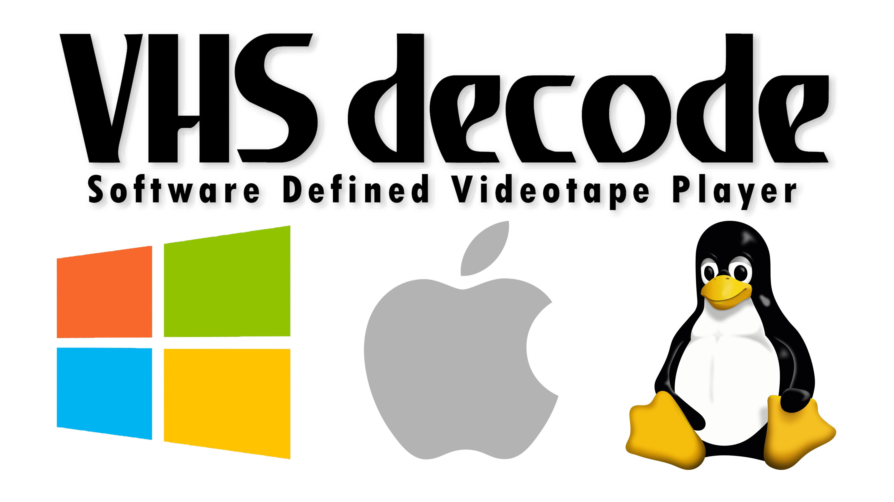

# VHS-Decode (It does more than VHS now!)


A fork of [LD-Decode](https://github.com/happycube/ld-decode), the decoding software powering the [Domesday86 Project](https://www.domesday86.com/).  

This version has been modified to work with the differences found in FM RF signals taken directly from colour-under & composite FM modulated videotape formats, captured directly from the heads pre-amplification & tracking stage before any internal video/hifi processing. 

------

> [!CAUTION]
> FM RF Archival captures and capturing is not to be confused with the TV Modulator/Demodulator pack's signals, i.e the **"antenna connectors"** on the back of a VCR!


SMPTE ColourBars (16:9) Test Tape With [WSS](https://github.com/oyvindln/vhs-decode/wiki/Wide-Screen-Signalling) (PAL) exported full-frame (1112 x 624)


# [Supported Tape Formats](https://github.com/oyvindln/vhs-decode/wiki/Tape-Support-List)


**VHS** 625-line and 525-line - NTSC, NTSC-J, PAL and PAL-M. **Generally well supported**

**SVHS** 625-line and 525-line - NTSC, NTSC-J, PAL and PAL-M. **Basic support**

**U-Matic Low Band** 625-line and 525-line - PAL and NTSC. **Supported**

**U-Matic High Band** 625-line - PAL. **Basic support**

**Betamax** 625-line and 525-line - PAL & NTSC. **Supported**

**SuperBeta** 525-line - NTSC. **Preliminary support** (Pal samples needed)

**Video8 & Hi8** 625-line and 525-line - PAL & NTSC. **Basic support**

**1" Type C (SMPTE Type C)** 625-line and 525-line - PAL & NTSC. **Basic support** (More Samples Required!) 

**1" Type B (SMPTE Type B)** 625-line and 525-line - PAL & NTSC. **Preliminary support** (More Samples Required!)

**EIAJ** 625-line - PAL. **Basic support** (NTSC Samples Required!) 

**Philips VCR** & **Philips VCR "LP"**  625-line - PAL. **Basic support**


# [FAQ - Frequently Asked Questions](https://github.com/oyvindln/vhs-decode/wiki/FAQ)


Example Videos: [VHS-Decode](https://odysee.com/@vhs-decode:7) / [The Rewinding](https://odysee.com/@therewinding:4?view=content) / [Video Dump](https://www.youtube.com/@videodumpchannel).

Example Workflow [Flowcharts and Overview Graphics](https://github.com/oyvindln/vhs-decode/wiki/Diagram-Visuals)

The frequently asked questions page and the [Wiki](https://github.com/oyvindln/vhs-decode/wiki), will help break things down and explain the real world benefits of direct RF capture preservation and software decoding compared to conventional high-cost hardware based workflows, so if you have just found this project welcome to the affordable future of tape media preservation.


# [CVBS-Decode - Composite Video Decoder](https://github.com/oyvindln/vhs-decode/wiki/CVBS-Composite-Decode)


This repository also contains an **experimental** CVBS decoder, `cvbs-decode`, which shares code with ld-decode and vhs-decode. Capable of decoding basic RAW digitized NTSC and PAL composite video, including colour if the source is somewhat stable. 

RAW CVBS has been captured using CX Cards & CXADC, however, only at lowest gain states and or with external signal feed into it to stop its hardware decoder from triggering.

> [!CAUTION]
> CVBS capture is not possible with the DomesDayDuplicator Rev3 due to input filtering on the hardware, but is possible with the [MISRC](https://github.com/oyvindln/vhs-decode/wiki/RF-Capture-Hardware#misrc---multi-input-simultaneous-raw-rf-capture) boards.

Test samples & signals can be digitally generated using [HackTV](https://github.com/fsphil/hacktv) or downloaded from [The Internet Archive](https://archive.org/details/wss-wide-screen-signaling).

# [HiFi-Decode](https://github.com/oyvindln/vhs-decode/wiki/003-Audio#hifi-decode-hifi-rf-into-audio-installation-and-usage) & [RTL-SDR Decode](https://github.com/oyvindln/vhs-decode/wiki/RTLSDR)


Thanks to VideoMem's work on [Superheterodyne Decoding Tools](https://github.com/VideoMem/Superheterodyne-decoding-tools) we now have a working [HiFi Audio Decoder](https://github.com/oyvindln/vhs-decode/wiki/003-Audio) which provides basic decoding support for VHS & Video8/Hi8 HiFi FM tracks which takes uncompressed or FLAC compressed RF captures of HiFi FM signals and outputs standard 24-bit 44.1-192kHz FLAC stereo audio files. The decoding quality is not yet up to the standard of the output from the conventional vcr decoding circuitry.

[RTLSDR capture & decoding](https://github.com/oyvindln/vhs-decode/wiki/RTLSDR) (cross plafrom as its 100% GNURadio based) can run in realtime on most systems (1~3 sec delay) and provide live playback, Alongside 8msps RF files and a 48kHz 24-bit FLAC file of the decoded audio.


# Dependencies - Hardware


## A Working Tape Player (VCR/VTR etc)


Preferably somewhat calibrated and in excellent mechanical and head condition, prosumer metal track decks are preferable as they were built generally better in terms of mechanical stability than cheaper later consumer decks that use more plastics. 

However, the only **critical requirement** is availible test points or a head amplifier that is easy to tap into, this goes for any and all tape formats. Since the rest of the circuitry is bypassed much of the difference between the VCR model lineup outside of head count/HiFi capability is also skipped and thus a good condition 90s HiFi VCR can give equally good results as a top of the line SVHS VCR.

> [!TIP]
> SVHS tapes can be RF captured on some newer standard VHS HiFi decks. 

> [!TIP]
> Since we bypass the decoding circuitry, it is not required that the VCR supports the TV system for the tape to be decoded correctly. The VCR does however need to be able to play the tape at the right speed - so one would be able to decode a PAL-M tape playing back in a American market NTSC VCR but not a standard PAL recording as NTSC only VCRs will normally not play those at the correct speed.

> [!IMPORTANT]  
> - Please read the [Cleaning & Servicing Guide](https://github.com/oyvindln/vhs-decode/wiki/Cleaning-&-Servicing-Guide).
> - **Always clean your tape track/drum/heads** before and afterwards with 99.9% isopropanol and lint free cloths/pads/paper. This ensures fewer dropouts from dirty heads or tracks including the track of the head drum.
> - Its good practice to avoid cross contamination of tapes, especially if dealing with mouldy or contaminated tapes.  
> - It also helps to make sure to re-lubricate metal and plastic moving joints cogs and bearings with appropriate greases and oils to avoid mechanical failures. 


## An RF Capture Device


> [!TIP]  
> Currently is there is 3 standardised hardware workflows, but [RF Capture is not just limited to these devices](https://github.com/oyvindln/vhs-decode/wiki/RF-Capture-Hardware).


## [Domesday Duplicator (DdD)](https://github.com/happycube/ld-decode/wiki/Domesday-Duplicator) (300-350USD*)


Capture is done using an intuitive GUI application.

[Linux / Windows / MacOS](https://github.com/harrypm/DomesdayDuplicator/wiki/Software-Setup-User-Guide#installing-the-software)

Built and geared towards capturing RF from Laserdisc players, it does however also work perfectly well for digitizing many forms of tape FM RF signals. It consists of a custom analogue to digital board with an amplifier, an off-the-shelf DE0-NANO FPGA development board, and a Cypress FX3 SuperSpeed Explorer USB 3.0 board.

> [!WARNING]  
> Don't use USB storage or video devices on the same USB bus as the DdD, it will crash the capture!

[Where to Buy? & More Info](https://github.com/happycube/ld-decode/wiki/Domesday-Duplicator)


## [CX Card & CXADC](https://github.com/oyvindln/vhs-decode/wiki/CX-Cards) (20-120USD)


Capture & Config uses simple command-line arguments and parameters to operate the [CXADC](https://github.com/happycube/cxadc-linux3) driver.

The most cost-effective approach is using a video capture cards based on a Conexant CX23880/1/2/3 PCI chipset. 

Today with a modified Linux driver, these cards can be forced to output RAW signal data that can be captured to file, instead of decoding video normally as they otherwise would, there is also a [Windows Driver](https://github.com/JuniorIsAJitterbug/cxadc-win) that's in-development.

While you can use any generic card with the correct chips, today we recommend the ‘‘New’’ Chinese variants that can be found on AliExpress that have integrated Asmedia or ITE 1x PCIE bridge chips allowing modern systems to use them, and consistent performance.

These cards combined with a [dedicated amplifier](https://github.com/oyvindln/vhs-decode/wiki/CX-Cards#external-amplification) & [the clockgen mod](https://github.com/oyvindln/vhs-decode/wiki/Clockgen-Mod) enabling Video + HiFi RF + Baseband (Baseband = linear or deck decoded HiFi audio) to be captured in perfect hardware sync, a highly reliable turn-key "one run and done" capturing workflow for a wide range of videotape formats.

[Where to Buy? & More Info](https://github.com/oyvindln/vhs-decode/wiki/CX-Cards)


# Dependencies & Installation - Hardware


> [!TIP]
> Please Read [Hardware Installation Guide](https://github.com/oyvindln/vhs-decode/wiki/Hardware-Installation-Guide) / [VCR Reports](https://github.com/oyvindln/vhs-decode/wiki/VCR-reports) / [The Tap List](https://github.com/oyvindln/vhs-decode/wiki/004-The-Tap-List)

Information on various VCRs that have been documented alongside high resolution pictures of VCR's that have had RF taps installed, guidance on recommended cables/connectors & tools to use are also included.

The setup process for RF capture involves running a short cable internally from points that provide the unprocessed modulated or "FM" video and or audio signal signals.

This cable is then routed to an added BNC jack at back of your metal/plastic VCR chassis or cable threaded out a vent, this allows direct access to the FM RF signals conveniently & reliably, we call this a `Tap Point` or `RF Tap` respectively for some decks and camcorders however DuPont connectors (2.54mm headers) and ribbon jigs can be used, but can be less mechanically safe/secure in some setups.

Adding an [amplifier](https://github.com/oyvindln/vhs-decode/wiki/Amplificaiton-R&D) in-between your RF Tap and your Bulkheads or cabled connection to an ADC solution can drastically improve the performance of lower signal level output machines, and reduce/eliminate issues such as cross-hatching from too much signal draw on the internal head amplifier, this also removes most needs to change any capture device gain levels.


````
- VCR Unit ==> Head Drum ==> RAW Signal From Heads ==> Amplification & Tracking IC ==> Tracked FM RF signals ==> 
- FM RF Test/Signal Points ==> Amplifier ==> FM RF Capture ==> 
- Software Decoding ==> Lossless 4fsc TBC Files ==> YUV Conversion ==> Standard Audio/Video Files.
````

> [!CAUTION]  
> Just because a test points has this name doesn't automatically mean it will have the signal we want, especially when it comes to hi-fi audio, be sure to check with the service manual if possible and do small test captures before finalizing any RF Tap setup. 


## Basic Guidance 


Finding Test Points

Decks follow this naming or close to it not every possible name is covered.

**Video FM RF Signal:**

`RF C`, `RF Y`, `RF Y+C`, `V RF`, `PB`, `PB.FM`, `V ENV`, `ENV`, `ENVE`, `ENVELOPE`, `VIDEO ENVE`, `VIDEO ENVELOPE`

**HiFi Audio FM Signal:**

`HiFi`, `A.PB`, `A FM`, `A.PB.FM`, `Audio FM`, `A ENV`, `HIFI Envelope`, `FM Mix Out`

**Linear Baseband Audio Signal**

`A-Out` (normally this is easy to tell, but always check service manuals) 


</details>

<details closed>
<summary>Parts for an RF Tap</summary>
<br>

[What tools do I need?](https://github.com/oyvindln/vhs-decode/wiki/Hardware-Installation-Guide)

* 50ohm BNC connectors, normally a [pre made bulkhead](https://s.click.aliexpress.com/e/_DCynGRN), or [solderable thread mounted](https://s.click.aliexpress.com/e/_Dd6dn0b).
* 50-100cm of [RG316](https://s.click.aliexpress.com/e/_DEjGLGT) or [RG178](https://s.click.aliexpress.com/e/_DBLPVc3) 50 ohm coaxial cable.
* 10uf Capacitors [standard ceramic assorment](https://s.click.aliexpress.com/e/_DlOEdSJ) or audio grade like Nichicon if you like.

Connection Cables

* [Direct BNC to BNC](https://s.click.aliexpress.com/e/_DdCYb1l) 
* [50Ohm BNC to BNC Cable](https://s.click.aliexpress.com/e/_DdPzXh5)

On [CX White Cards](https://github.com/oyvindln/vhs-decode/wiki/CX-Cards) you use the RCA (Vmux 1) for the RF input with C31 capacitor removed, but a BNC can be easily added.


</details>

<details closed>
<summary>Install A RF Tap</summary>
<br>


> [!TIP]  
> The [Hardware Installation Guide](https://github.com/oyvindln/vhs-decode/wiki/Hardware-Installation-Guide) visually goes over all the installation steps for tape decks to Sony 8mm camcorders.

Adding a 10uf (0.1uf to 100uf range) capacitor to the test point or amplifier is recommended can help improve signal integrity (a handful VCRs have this on the test point already).

Center is Signal, Outer is Ground, this goes for jacks and for coaxial cable in general.

For an polarized electrolytic capacitor Positive leg (longer) goes on test/signal point, Negative leg (shorter) on cable to connector/probe. 

However, this does not matter for Ceramic which are bidirectional & recommend today.

While type and voltage does not matter drastically it's best to use new/tested capacitors.

</details>


## Important Notes:


- We use AliExpress links for wide availability globally, but local vendors are a thing.

- With some Sony decks you can use Dupont connectors on the test point pins making an easy RF tap.

- Do not make sharp bends in any RF cabling, keep total cable runs as short as possible Ideally 30-60cm, more cable = more signal loss.

- Some UMATIC decks have an RF output on the back, however this only provides Luma RF for dropout detection and not the full signal required for RF capture.


# Dependencies & Installation - Software


VHS-Decode, as with LD-Decode, has been developed and tested on machines running the latest versions of Ubuntu, Debian, Linux Mint & Windows 10/11, and has user testing on current versions of MacOS.

The tools should however be able to be built on other distributions too provided they have access somewhat recent versions to the needed dependencies, including at least python 3.8.

There is a [Linux compatibility doc](https://docs.google.com/document/d/132ycIMMNvdKvrNZSzbckXVEPQVLTnH_YX0Oh3lqtkkQ) for various tested distributions of Linux.

Other dependencies include Python 3.8+, numpy, scipy, cython, numba, pandas, Qt5, qwt, Cmake, and FFmpeg.

</details>


<details closed>
<summary>Windows Builds</summary>
<br>

[Windows Setup & Usage Docs](https://github.com/oyvindln/vhs-decode/wiki/Windows-Build)

The ld-tools suite, tbc-video-export and combined exe version of `ld-decode` / `vhs-decode` / `cvbs-decode` / `hifi-decode` which is simply `decode.exe` exists for Windows and is entirely self-contained or portable. 

This allows the use of ld-analyse's GUI to view TBC files, ld-lds-converter to convert and compress DdD captures inside Windows with drag and drop bat scripts.

The decode suite can also be built & run natively on Windows 10/11 or built inside [WSL2](https://github.com/oyvindln/vhs-decode/wiki/WSL2-Setup) 22.04.1 LTS (Windows Subsystem for Linux) however issues with larger captures i.g 180gb+ may require expanding the default [virtual disk size](https://docs.microsoft.com/en-us/windows/wsl/vhd-size).


</details>


<details closed>
<summary>MacOS Builds</summary>
<br>

[MacOS Setup & Usage Docs](https://github.com/oyvindln/vhs-decode/wiki/MacOS-Build)

Currently, MacOS builds while supported and deployable these are not directly verified and tested by the developers of ld-decode or vhs-decode due to lack of owning physical Apple M1 or newer hardware.


</details>

<details closed>
<summary>Installation on Linux (Ubuntu/Debian-based)</summary>
<br>


Install all dependencies required by LD-Decode and VHS-Decode:

    sudo apt install git qtbase5-dev libqwt-qt5-dev libfftw3-dev libavformat-dev libavcodec-dev libavutil-dev ffmpeg pv pkg-config make cmake sox pipx g++ python3-dev

Ubuntu 22.04/Linux Mint 21/Debian may also need this library installed if one wants to use the GUI version of hifi-decode:

    sudo apt install libxcb-cursor0

For Arch Linux

    pacman -S base-devel git qt5-base qwt fftw ffmpeg pv cmake sox python python-pipx

Set up pipx

    pipx ensurepath

(Alternatively, a [python virtual environment](https://docs.python.org/3/library/venv.html) can be used instead of using pipx)

Install TBC-Video-Export

    pipx install tbc-video-export

(There is also [self-contained builds](https://github.com/JuniorIsAJitterbug/tbc-video-export/releases) if install issues arise)

Optional dependencies for GPU (Nvidia Cards) FLAC compression support:

    sudo apt install make ocl-icd-opencl-dev mono-runtime

Also Requires FlaLDF [Download & Install via .deb for Linux](https://github.com/TokugawaHeavyIndustries/FlaLDF/releases/tag/v0.1b)


## Build VHS-Decode & LD-Tools Suite


The vhs-decode repository also has hifi-decode, cvbs-decode, ld-decode included.

Download VHS-Decode:

    git clone https://github.com/oyvindln/vhs-decode.git vhs-decode

Install VHS-Decode:

    cd vhs-decode

Build and install vhs-decode via pipx

    pipx install .[hifi_gui_qt6]

Compile and Install ld-tools suite: (Required)

    mkdir build2
    cd build2
    CXXFLAGS="-march=native" CFLAGS="-march=native" cmake .. -DCMAKE_BUILD_TYPE=Release -DUSE_QT_VERSION=5
    make -j4
    sudo make install

Go back to the main directory with 

    cd .. 


## How to Update


To update your local repository enter `git pull` into the terminal while inside the vhs-decode directory, and then do `pipx install .[hifi_gui_qt6] --force` it will overwrite your previous installation and deploy the current version of the decoders.

To update the tools to the latest version, the steps under "Compile and Install ld-tools suite: (Required)" has to be re-ran after a `git pull`. The tools are not updated very often.

> [!NOTE]  
> debian/ubuntu does not have a qt6 version of qwt in repositories as of yet, so you have to inform the build script to use Qt5 if both qt5 and qt6 are installed with `-DUSE_QT_VERSION=5` as it might otherwise try to compile with qt6 instead and failing to locate qwt. The option is otherwise not needed.


# Usage


Note with WSL2 & Ubuntu, `./` in front of applications and scripts may be needed to run them or to run scripts within the folder.

Use `cd vhs-decode` to enter into the directory to run commands, `cd..` to go back a directory.

Use <kbd>Ctrl</kbd>+<kbd>C</kbd> to stop the current process.

You don't actually type `<` and `>` on your input & output files.


</details>


# FM RF Capture 


Here's the full [RF Capture Guide](https://github.com/oyvindln/vhs-decode/wiki/RF-Capture-Guide)

But to get started here is a simplified guide:


<details closed>
<summary>Basic CX Card Setup & RF Capture</summary>
<br>


* Ensure system is powered off
* Physically Install CX Card
* Install CXADC driver

------------

Connect Card to RF Tap

* Find Vmux Input (Via Live Preview)
* Configure Capture
* Capture RF Data
* FLAC Compress RF Data (Archive)

[CXADC Readme](https://github.com/happycube/cxadc-linux3#readme) for information on how to install & configure the driver, this also goes into depth on modes.

[Commands for real-time FLAC capture on CX Cards](https://github.com/happycube/cxadc-linux3/wiki/FLAC-Compression-Guide)

[Naming Guide For RF Captures!](https://github.com/oyvindln/vhs-decode/wiki/Capture-Naming-Guide)

To see if you have a connection, use the live preview mode and then hook up your RF cable, normally you will see a white flash as a signal, if not change your vmux or input within a 0-2 range with the below command.

    sudo echo 0 >/sys/class/cxadc/cxadc0/device/parameters/vmux

To see a live preview of tape signal being received by a CXADC card, note that the video head tracked signal will be unstable or wobbly if settings are not the same; you may only see "signal flash" if in 16-bit mode for example.

This is quite useful if you don't own a CRT with Horizontal/Vertical shifting, as it will allow you to inspect the full area for alignment and/or tracking issues.

PAL framing for the default 28.64 MHz/8-bit mode:

    ffplay -hide_banner -async 1 -f rawvideo -pix_fmt gray8 -video_size 1832x625 -i /dev/cxadc0 -vf scale=1135x625,eq=gamma=0.5:contrast=1.5

NTSC framing for 28.64 MHz/8-bit mode:

    ffplay -hide_banner -async 1 -f rawvideo -pix_fmt gray8 -video_size 1820x525 -i /dev/cxadc0 -vf scale=910x525,eq=gamma=0.5:contrast=1.5

Capture 30 seconds of tape signal using CXADC driver 8-bit samples

    timeout 30s cat /dev/cxadc0 > <capture>_CXADC.u8

For 16-bit, simply change the output filename extension to `.u16`

For FLAC captures, set the output filename extension to your desired tape format, for example `.VHS`

It is recommended to use a fast storage device with 40-100 MB/s or faster write capacity, in order to avoid dropped samples, ideally an dedicated SSD (via M.2 or SATA connector, not USB) formatted with the exFAT filesystem.


## What should a FM video signal look like on the preview?


</details>


## Compress Your Captures!


> [!CAUTION]  
> Ignoring this will cost you a lot of storage space! 

The FM RF archival workflow may seem initially daunting in terms of RAW storage space usage, however thanks to this data being PCM style data, just like audio but with some extra zeros on the end, we can simply use lossless compression, with FLAC this is a 40-60% reduction of file sizes, which is normally under 1GB/minute down to 325MB/minute! (depending on sample rate & bit-depth used for capture).

After this compression your data is still able to be decoded with the added benefit of easily being able to open for [visual inspection](https://github.com/oyvindln/vhs-decode/wiki/Advanced-RF-Analysis) and manipulation. 

</details>

<details closed>
<summary>CX Card Users</summary>
<br>

For CXADC and other standard 8-bit or 16-bit RF captures use the following:

[Copy Paste FLAC Compression Commands for CXADC](https://github.com/happycube/cxadc-linux3/wiki/FLAC-Compression-Guide#post-capture-flac-compression)

</details>

<details closed>
<summary>DomesDay Duplicator Users</summary>
<br>


For DomesDayDuplicator captures on Linux simply run:

`ld-compress <capture>`

For DomesDayDuplicator captures on Windows simply drag and drop on: 

`ld-compress.bat` or `ld-compress-nvidia-gpu.bat`

Your `.lds` file will be compressed to an FLAC OGG `.ldf` file.

</details>

<details closed>
<summary>Manual Compression & De-Compression </summary>
<br>

Editable flags are:

The `--bps` flag can be changed to `--bps=8` or `--bps=16` for 8 & 16 bit captures and `--ogg` is optional.

Change `<capture>` & `<output-name>.flac` to your input & output file name.

Reduce size of captured CXADC data (by 40-60%):

    flac --best --sample-rate=28636 --sign=unsigned --channels=1 --endian=little --bps=8 --ogg -f <capture>.u8 <output-name>.flac

Output will be `<output-name>.flac` if wanted you can rename the end extension to `.vhs` / `.hifi` etc, but include `_8-bit_28msps` and `NTSC or PAL` etc in the name, to always know what the data and tape format is. 

Decompress FLAC compressed captures:

    flac -d --force-raw-format --sign=unsigned --endian=little <capture>.vhs <capture>.u16

</details>


# Decoding FM RF Captures


> [!TIP]  
> - `.tbc` files are headerless you can open them at any time during decoding, preview is limited to what frame info has been fully written to the JSON file updated every 100 frames or so.
> - You can download example demo tapes [here](https://archive.org/details/@decode_team_fm_rf_archives).


Decode your captured tape to `.tbc` by using:

    vhs-decode [arguments] <capture file> <output name>

Full Usage Example:

    vhs-decode --debug --ire0_adjust --frequency 28.6 --pal --threads 8 --tape_format VHS CX-White-2022.10.25.u8 my-first-decode-2022.10.25

Use analyse tool during or after decoding to inspect decoded data:

    ld-analyse <decoded tape name>.tbc

After decoding process your tapes VBI data with:

    ld-process-vbi <decoded tape name>.tbc


## Output File Format


VHS-Decode produces [4fsc sampled](https://github.com/oyvindln/vhs-decode/wiki/Signal-Sampling#4fsc), non-square pixel, timebase corrected headerless files, there are two formatting versions of these files. 

- S-Video signal in two files for colour-under format tape media such as VHS/Umatic/Betamax/SuperBeta/Video8/Hi8 etc. 

- Composite/CVBS signal in a single file for SMPTE-C/B/A this also applies to 2" Quad and LaserDisc & anything CVBS-Decode. 

These `tbc` files store 16-bit `GREY16` headerless data separated into chroma/luma composite video signals in the `.tbc` format `filename.tbc` & `filename_chroma.tbc` respectively alongside `.json` and `.log` files which carry the frame, tv system and decode information, usable with the LD-Decode family of tools ld-analyse, ld-process-vbi, ld-process-vits, ld-dropout-correct & ld-chroma-decoder etc.


## Exporting to Video Files


> [!IMPORTANT]  
> [Read the full export guide here!](https://github.com/oyvindln/vhs-decode/wiki/TBC-to-Video-Export-Guide)

Linux, MacOS & Windows

    tbc-video-export Input-Media.tbc

This will create an FFV1 10-bit 4:2:2 MKV File ready for playback or post-processing. 


The export tool will by default render a lossless, interlaced top field first and high-bitrate (roughly 70-100 Mb/s) FFV1 codec video which, which although ideal for archival and further processing has only recently started to gain support in modern [NLEs](https://en.wikipedia.org/wiki/Non-linear_editing).

Some recommended free tools for post-processing are:

- [StaxRip](https://github.com/staxrip/staxrip) & [Hybrid](https://www.selur.de/downloads)

- [Lossless Cut](https://github.com/mifi/lossless-cut) & [DaVinci Resolve](https://www.blackmagicdesign.com/uk/products/davinciresolve) 

These cover editing to across operating systems, and can provide an easier FFmpeg/AviSynth/VapourSynth encoding and QTGMC de-interlacing experience, and full colour grading and post-production ability.


## Profile Options 


For archival to web use we have a wide range of premade FFmpeg profiles defined inside the `tbc-video-export.json` file.

> [!WARNING]  
> - Odysee uploads the provided web AVC files are ideal.
> - Vimeo uploads de-interlace the FFV1 export it re-encodes progressive SD quite well. 
> - YouTube de-interlace and upscale to 2880x2176 with HEVC 120Mbps (anything below the 4k bracket is destroyed by compression.)


The stock profiles for web use the BDWIF deinterlacer, but QTGMC is always recommended give the [de-interlacing guide](https://github.com/oyvindln/vhs-decode/wiki/Deinterlacing) a read for more details.

ProRes 4444XQ & FFV1 with PCM audio have been added for editing support.

Define your profile with for example: `--profile ffv1_8bit_pcm`

</details>

<details closed>
<summary>Encoding Profile List</summary>
<br>

| Profile Name  | Codec         | Compression Type     | Bit-Depth | Chroma Sub-Sampling | Audio Format | Container | File Extension | Bitrate    |
|---------------|---------------|----------------------|-----------|---------------------|--------------|-----------|----------------|------------|
| ffv1          | FFV1          | Lossless Compressed  | 10-bit    | 4:2:2               | FLAC Audio   | Matroska  | .mkv           | 70-100mbps |
| ffv1_8bit     | FFV1          | Lossless Compressed  | 8-bit     | 4:2:2               | FLAC Audio   | Matroska  | .mkv           | 40-60mbps  |
| ffv1_pcm      | FFV1          | Lossless Compressed  | 10-bit    | 4:2:2               | PCM Audio    | Matroska  | .mkv           | 70-100mbps |
| ffv1_8bit_pcm | FFV1          | Lossless Compressed  | 8-bit     | 4:2:2               | PCM Audio    | Matroska  | .mkv           | 40-60mbps  |
| prores_hq_422 | ProRes HQ     | Compressed           | 10-bit    | 4:2:2               | PCM Audio    | QuickTime | .mov           | 55-70mbps  |
| prores_4444xq | ProRes 4444XQ | Compressed           | 10-bit    | 4:4:4               | PCM Audio    | QuickTime | .mov           | 80-110mbps |
| v210          | V210          | Uncompressed         | 10-bit    | 4:2:2               | PCM Audio    | QuickTime | .mov           | 200mbps    |
| v410          | V410          | Uncompressed         | 10-bit    | 4:4:4               | PCM Audio    | QuickTime | .mov           | 400mbps    |
| x264_web      | AVC/H.264     | Lossy                | 8-bit     | 4:2:0               | AAC Audio    | QuickTime | .mov           | 8mbps      |
| x265_web      | HEVC/H.265    | Lossy                | 8-bit     | 4:2:0               | AAC Audio    | QuickTime | .mov           | 8mbps      |

</details>


## Time Control & Audio Muxing


- `-s` Skips number of frames `-s 25` for example skips 1 second of PAL video.

- `-l` Defines length to export so `-l 1500` is 1 minute of PAL video at 25fps or `-l 1500` for NTSC at 29.97fps

- `--audio-track` Embed an audio file example: `--audio-track HiFi_24-bit_192khz.flac` & `--audio-track Linear_24-bit_48khz.flac` from [HiFi-Decode](https://github.com/oyvindln/vhs-decode/wiki/HiFi-Decode).


Full Example:

Linux, MacOS & Windows:

    tbc-video-export -s 50 -l 1500 --audio-track HiFi_24-bit_48khz.flac --audio-track Linear_24-bit_48khz.flac Input.tbc


## VBI (Vertical Blanking Interval) Recovery & Preservation


Linux, MacOS & Windows:

    tbc-video-export --vbi input.tbc

This creates a scaled `720x608 PAL` or `720x508 NTSC` (IMX/D10) standard video file with the top VBI space visually exported. 


Software decoding provides the full signal frame to work with, including the VBI space, as such recovery software can be used to read and extract this information, or it can be exported visually unlike legacy (and broadcast specialised) capture hardware.

The decode projects tool suite has built-in tools for this `ld-process-vbi` & `ld-process-vits` supporting decoding of VITC, VITS & Closed Captions from your `.TBC` files and saves it inside the `.JSON` metadata file alongside the outer tape technical data. 


[VITC Timecode](https://github.com/oyvindln/vhs-decode/wiki/VITC-SMPTE-Timecode) (Standard SMPTE Timecode)

[CC EIA-608](https://github.com/oyvindln/vhs-decode/wiki/Closed-Captioning) (Closed Captioning)

[Teletext](https://github.com/oyvindln/vhs-decode/wiki/Teletext) (European Subtitles & Information Graphics)

[Tape-based Arcade Games!](https://vhs.thenvm.org/resources/)

[Ruxpin TV Teddy](https://github.com/oyvindln/vhs-decode/blob/vhs_decode/tools/ruxpin-decode/readme.pdf) (Extra audio in visible frame)


# Terminal Arguments


The decoder's support various arguments to change how captured tape recordings are processed. 

These vary slightly between formats like VHS & Umatic, but the basic arguments remain the same.

The list below is a short list for common/daily usage but does not cover all the abilities and new or advanced command arguments possible, so please read the [complete and up-to-date command list](https://github.com/oyvindln/vhs-decode/wiki/Command-List) on the wiki as commands may change or be deprecated, so its always good to check this list for any updates or specific issues you're trying to correct. 


## Sample Rate Commands


> [!CAUTION]  
> This is a mandatory setting for the decoders to work.

By default, this is set to 40 MHz (40Msps) (the sample rate used internally and by the Domesday Duplicator) at 16 bits.

The decoder is 8/16 bit agnostic so as long as sample rate is defined, it will decode it same for 10-bit packed captures and if its FLAC compressed.

`-f` Adjusts sampling frequency in integer units.

Example's `-f 280000hz` or `-f 28mhz` or `-f 8fsc` 

In the case of stock CX Card use `-f 28.6` for example or [legacy CXADC designers](https://github.com/oyvindln/vhs-decode/wiki/Command-List#cxadc-sample-rates-stock).


## TV System Commands


> [!CAUTION]  
> This is a mandatory setting for the decoders to work as intended.

Changes the [TV System](https://github.com/oyvindln/vhs-decode/wiki/TV-Systems) (line system & respective, colour system if any) to your required regional media format. 

> [!NOTE]  
> - Support for PAL-M is **experimental**.
> - [MESECAM](https://github.com/oyvindln/vhs-decode/wiki/Decoding-SECAM-&-MESECAM) (requires extra GNUradio script for decoding colour after the TBCs currently)


`--system` followed by the TV System 

Options are: `NTSC`, `PAL`, `PAL-M`, `NTSC-J` & `MESECAM`

For example: `--system NTSC`


## Tape Format Commands


> [!CAUTION]  
> This is a mandatory setting for the decoders to work properly.

`--tf` or `--tape_format` sets the format of media you wish to decode. 

Current Options are `VHS` (Default), `VHSHQ`, `SVHS`, `UMATIC`, `UMATIC_HI`, `BETAMAX`, `BETAMAX_HIFI`, `SUPERBETA`, `VIDEO8`, `HI8` ,`EIAJ`, `VCR`, `VCR_LP`, `TYPEC` & `TYPEB`.

Example: `--tape_format vhs` 


## Tape Speed Commands


> [!WARNING]  
> This is not a mandatory setting for the decoders to work properly, but can make a "visual" difference in decoding results. 

`--ts` or `--tape_speed` sets the tape speed of media you wish to decode. 

Tape speed adjusts the format parameters slightly so will not always make a difference, but it can make one for LP tapes for example. 

`SP` (default), `LP`, `SLP`, `EP`, and `VP`. Only supported for some formats such as but not limited to (S)VHS & Sony 8mm. 

Example: `--tape_speed LP` 

> [!NOTE]  
> SLP and EP refers to the same speed.


## [Time & Location Control](https://github.com/oyvindln/vhs-decode/wiki/Command-List#time--location-control)


These commands are used for jumping ahead in a file or for defining limits.
Useful to recover decoding after a crash, or for limiting process time by producing shorter samples.

`-s`  Jumps ahead to any given frame in the capture.

`--start_fileloc` Jumps ahead to any given *sample* in the capture.

`-l` Limits decode length to *n* frames.

`-t` Defines the number of processing threads to use during demodulation, decode cant use more then 6-8 threads per decode currently so using 8 threads is the practical limit as its mostly a single core task.

> [!CAUTION]  
> Upon crashing, vhs-decode automatically dumps the last known sample location in the terminal output.


## [Time Base Correction & Visuals Control](https://github.com/oyvindln/vhs-decode/wiki/Command-List#decode-tbc---time-base-correction-control)


`--debug` sets logger verbosity level to *debug*. Useful for debugging and better log information. (Recommended to enable for archival.)

`--ire0_adjust` Automatically adjust the black/video level on a per-field basis, using the back porch level. Unlike `--clamp` this is done after time base correction. Therefore it can fix the per-field variations caused by the slight carrier shift of VHS-HQ and S-VHS. [more info](https://github.com/oyvindln/vhs-decode/pull/163).

`--ct` enables a *chroma trap*, a filter intended to reduce chroma interference on the main luma signal. Use if seeing banding or checkerboarding on the main luma .tbc in ld-analyse.

`--recheck_phase` re-check chroma phase on every field, fixes most colour issues. (No effect on U-matic.)

`--sl` defines the output *sharpness level*, as an integer from 0-100, the default being 0. Higher values are better suited for plain, flat images i.e. cartoons and animated material, as strong ghosting can occur. (Akin to cranking up the sharpness on any regular TV set.)

`--dp demodblock` displays Raw Demodulated Frequency Spectrum Graphs, makes a pop-up window per each thread so -t 32 will give you 32 GUI windows etc


## Input file formats:


> [!NOTE]  
> The decoders can be RAW uncompressed data or FLAC compressed data. 

> [!TIP]  
> .RAW will need to be renamed to s16/u16 

`.ldf`/`.lds` (40Msps Domesday Duplicator FLAC-compressed and uncompressed data).

`.r8`/`.u8`   (CXADC 8-bit raw data).

`.r16`/`.u16` (CXADC 16-bit raw data).

.flac/.cvbs/.vhs/.svhs/.betacam/.betamax/.video8/.hi8 (FLAC-compressed captures, can be either 8-bit or 16-bit).

> [!CAUTION]  
> If using custom extensions include, `tv system`, `bit depth`, and `sample rate xxMSPS` inside the file name so it's clear what basic settings you will need to use to decode it, and it helps a lot when sharing or archiving something to know what it actually is.


## Output file formats:


Unlike CVBS-Decode & LD-Decode, VHS-Decode does not output its timebase-corrected frames as a single Composite `.tbc` file for colour-under formats, but does for composite modulated ones such as SMPTE-C.

Both the luminance and chrominance channels are separate data files, essentially digital "S-Video", additionally useful for troubleshooting. Descriptor/log files are generated so you end up with 4 files with the following naming:

`filename.tbc`        - Luminance (Y) Image Data (Combined Y/C for CVBS)

`filename_chroma.tbc` - Chrominance (C) Image Data (QAM Modulated)

`filename.tbc.json`   - Frame Descriptor Table (Resolution/Dropouts/SNR/Frames/VBI Timecode)

`filename.log`        - Timecode Indexed Action/Output Log


# Join us!


- [Discord](https://discord.gg/pVVrrxd)

- [Reddit](https://www.reddit.com/r/vhsdecode/)


# Support us! 


- [Donations](https://github.com/oyvindln/vhs-decode/wiki/Donations)


# More Documentation


- [VHS-Decode Wiki](https://github.com/oyvindln/vhs-decode/wiki)

- [Extra Documentation](https://github.com/oyvindln/vhs-decode/wiki/Documents)


## *If in doubt - feel free to read the docs/wiki again, if its not there then ask!*


For future documentation changes, speak with [Harry Munday](https://github.com/harrypm) (harry@opcomedia.com) or on Discord (therealharrypm)
