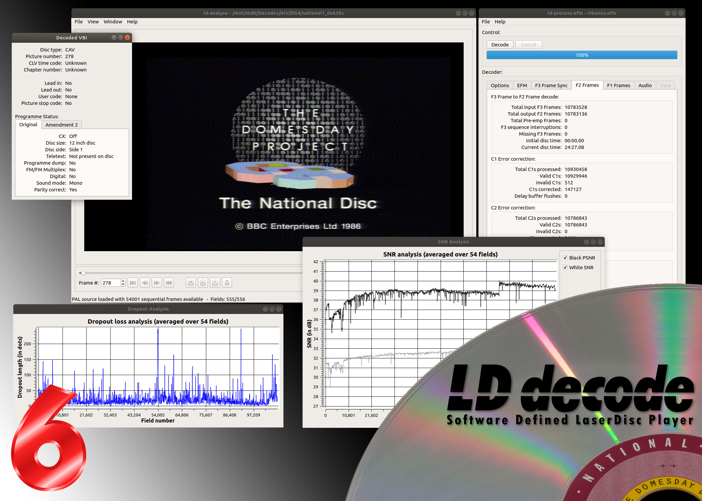

# Home

Welcome to the ld-decode documentation.

ld-decode is an open-source effort to provide a "software defined LaserDisc player".  The project is completely open and we welcome your contributions to both [the project source code](https://github.com/happycube/ld-decode) as well as this documentation as both are available on GitHub for you to use, enjoy and extend.

The project aims to take high-quality FM RF Archival captures of LaserDiscs captured using specialized hardware and decode the RF back into usable component parts such as composite video, analogue audio and digital data and audio too. Examples of such hardware are:

- [The Domesday Duplicator](https://github.com/simoninns/DomesdayDuplicator){target="_blank"} - this is the reference hardware for ld-decode
- [CX Cards](https://github.com/oyvindln/vhs-decode/wiki/CX-Cards){target="_blank"}
- [MISRC](https://github.com/Stefan-Olt/MISRC){target="_blank"}
- [Hsdaoh](https://github.com/oyvindln/vhs-decode/wiki/RF-Capture-Hardware#hsdaoh-method){target="_blank"}

The decoding process (like a real LaserDisc player) is a multi-stage process.  The raw RF must be demodulated (from the original FM signal) and filtered into video, audio and EFM data. This data is then framed and passed through a digital time-base correction (TBC) process which attempts to remove errors caused by the mechanical nature of a LaserDisc player during capture.

The resulting lossless 4fsc sampled TBC output then requires decode processing in order to result in usable video and sound (in modern formats).  For this please see the [Decode Orc project](https://simoninns.github.io/decode-orc-docs){target="_blank"}

An overview of how a LaserDisc player functions (which can help you to understand the component parts of ld-decode) is available from [this link](https://simoninns.github.io/DomesdayDuplicator-docs/Misc/Laserdisc-Player.html){target="_blank"}.

# Current status

ld-decode revision 7 is the current release of the decoder.  ld-decode is capable of decoding a wide-range of PAL and NTSC LaserDiscs with support for both analog and digital sound tracks (as well as EFM data tracks as used in Interactive Video systems such as the BBC Domesday system)

