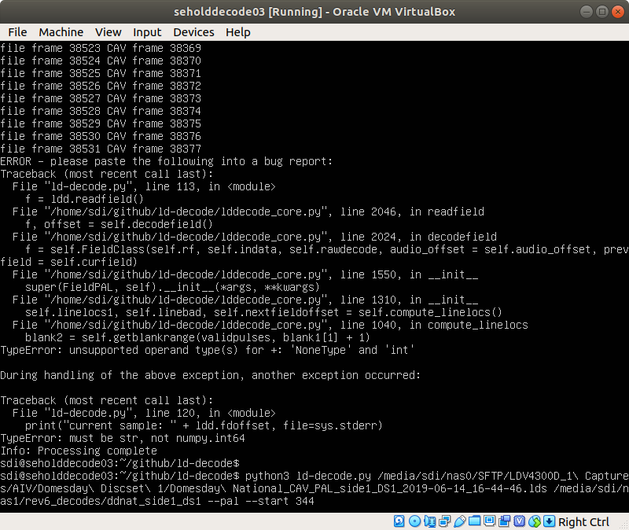

# Submitting a bug report

ld-decode is amazing; but like all amazing software sometimes it crashes.  If this happens to you, don't just sigh and move on; report it!  Reporting bugs is great way to help the project even if you're not a super-coder with 10M lines of GPL behind you.

Please note that the ld-decode project accepts issue reports for issues found on the supported OS only - Ubuntu 22.04 LTS.  If you are running on another Linux distro or OS (such as Mac OS or Windows) please either reproduce the problem on the supported OS version before reporting or submit the issue report to the maintainer of your build.  Generally issues not reproduced on Ubuntu 22.04 LTS will be *rejected without investigation*.

# Here's how to help!

When ld-decode goes wrong it will typically crash with an error report asking you to copy it into the bug report, just like in the following screen shot:

At the point of the issue you will see that ld-decode has reported the last good frame it decoded, something like "File frame 38531 CAV frame 38377" where 38531 is the sequential position of the frame in the .lds file and 38377 is the frame number according to the VBI (if it was present).

You can cut out the bit of the .lds file and provide it to the developers - this makes life much easier as they will be able to recreate the conditions in which the crash occurred.

To do this there is a utility called ld-cut.py.  Since github has restrictions on how much you can upload to an issue, it's a great idea to snip out no more than 10-15 frames from your .lds.  So following the example above, we can get the frame that caused the crash with a command like this:

`python3 ld-cut.py myldsfile_in.lds ldsforgithub_out.lds -s 38528 -l 10`

This will start at sequential frame 38528 (just before our issue) and continue for 10 frames.  If you are using a PAL source, you'll need to add --pal to the end of the line.

Before zipping up the .lds snippet and sending it, it would be really nice of you if you would run ld-decode again against the new snippet and confirm that the snippet is correct and that the crash occurs.  If you get stuck here, or the crash doesn't occur again, please still report the issue, but make a note of this.

Once you've got the new .lds file and verified it, zip it up to make it nice and small.

# Submitting the report on github

Now head over to the github repo and click on '[Issues](https://github.com/happycube/ld-decode/issues)' then 'New issue' (the big green button on the top-right). Cut and paste in the output from ld-decode and drag your .lds zip file over to the issue reporting window.  Github will attach it for you.  With any issue, more information is better than less.  Feel free to write your new novel about how it crashed and what you did.

If you are not running on the supported Ubuntu 22.04 LTS environment or there is any else unusual about your set-up *absolutely make sure you mention this* even if you don't think it's important.  It will save a lot of time and effort for the developers.

# What happens next?

Once submitted you will be automatically included in to the ld-decode extended family and receive lots of nice emails as your issue is categorised and fixed.  Of course, there is the possibility that you made a mistake, did something that wasn't supposed to work or simply found a bug that isn't a priority to fix.  Don't panic, you're still awesome - it's just that there are limited resources to go around and everyone is working for free in their spare time.
